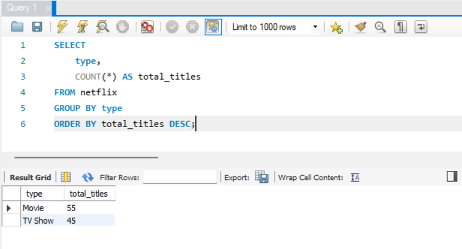
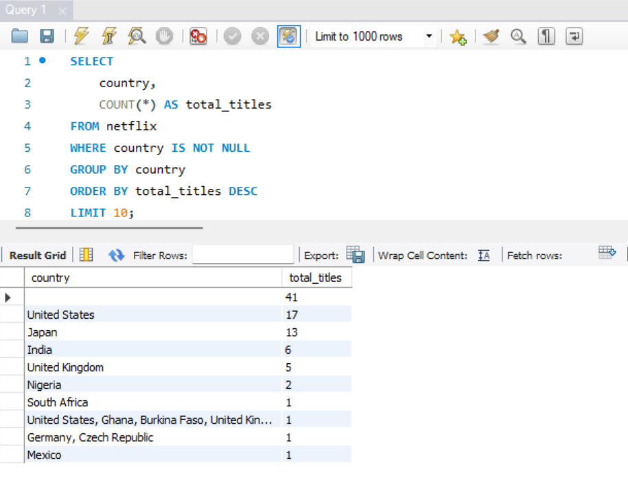
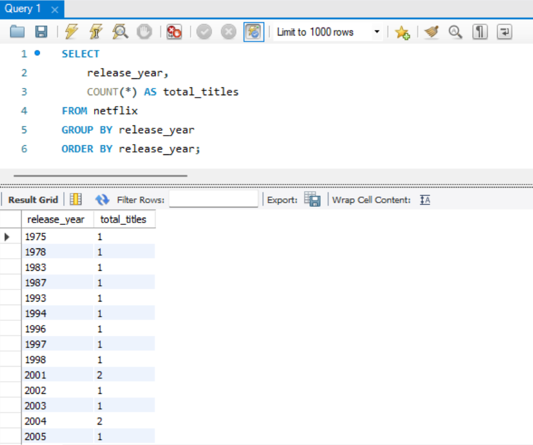
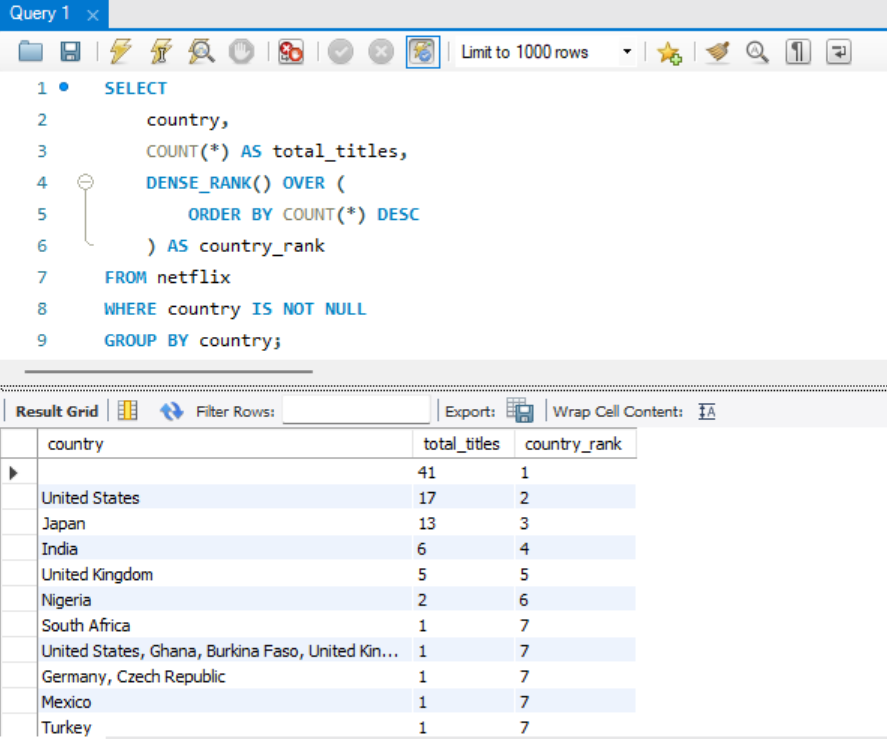
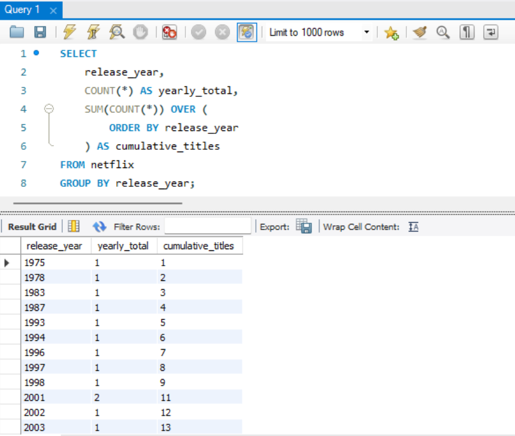
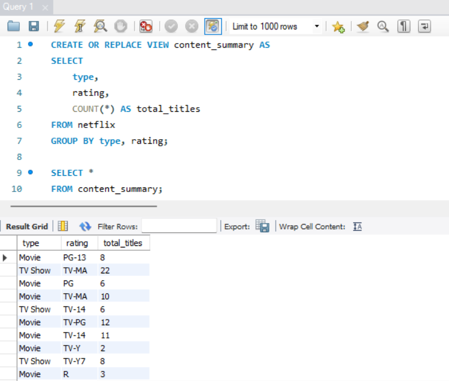
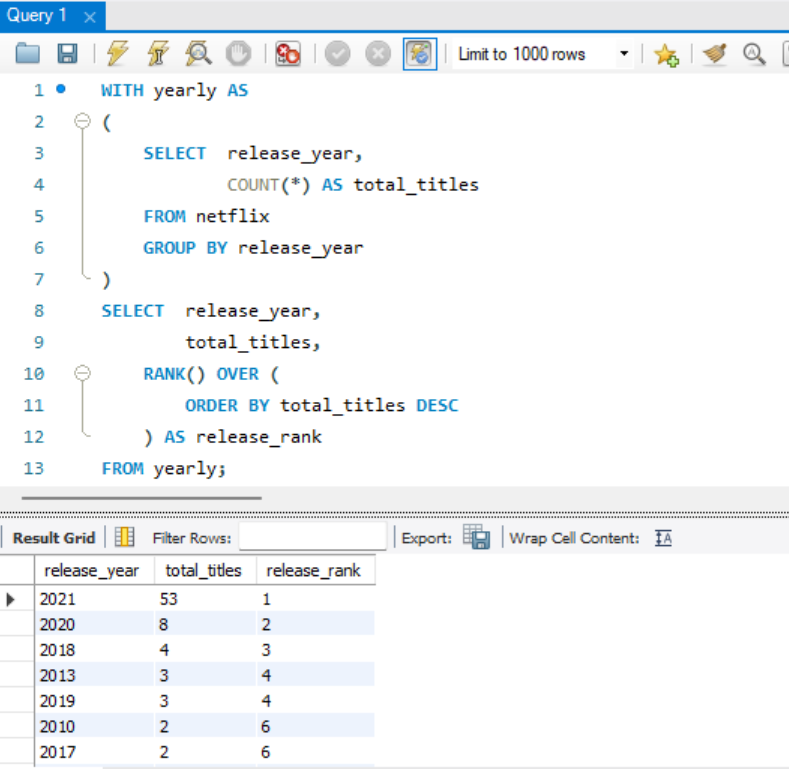

# 🎬 Content Trends Analysis using SQL

An end-to-end SQL data analysis project that explores Netflix content trends using MySQL. The project focuses on transforming raw data into meaningful business insights through advanced SQL techniques such as Common Table Expressions (CTEs), Window Functions, Subqueries, Views, and Conditional Logic.

---

## 📖 About the Project

Streaming platforms generate massive amounts of content data every year. Understanding how content is distributed, produced, and categorized can help businesses identify market trends and make data-driven decisions.

In this project, I analyzed a Netflix dataset to answer real-world business questions related to content production, release patterns, ratings, countries, directors, and overall catalog growth. The analysis combines both fundamental and advanced SQL concepts to uncover meaningful insights from the dataset.

---

## 🎯 Objectives

- Explore and validate the dataset
- Analyze the distribution of Movies and TV Shows
- Identify release trends over time
- Discover the top content-producing countries and directors
- Examine content ratings and duration
- Measure catalog growth using window functions
- Solve business questions using advanced SQL techniques

---

## 🛠️ Tools & Technologies

- MySQL
- MySQL Workbench
- SQL
- VS Code
- Git
- GitHub

---

## 📂 Project Structure

```text
Content-Trends-Analysis-SQL
│
├── data/
│   └── netflix_titles.csv
│
├── sql/
│   └── analysis.sql
│
├── screenshots/
│
├── README.md
│
├── .gitignore
│
└── LICENSE
```

---

## 📌 SQL Skills Demonstrated

- Data Exploration
- Data Validation
- Aggregate Functions
- GROUP BY & ORDER BY
- CASE Statements
- String Functions
- Date Functions
- Type Conversion
- Subqueries
- Common Table Expressions (CTEs)
- Window Functions
- RANK() & DENSE_RANK()
- LAG()
- Running Totals
- Views
- Business-Oriented Data Analysis

---

## 💼 Business Questions Solved

- How many titles are available in the dataset?
- What percentage of the catalog consists of Movies versus TV Shows?
- How has content production evolved over the years?
- Which countries contribute the most titles?
- Which directors have produced the highest number of titles?
- What are the most common audience ratings?
- Which movies have the longest and shortest durations?
- Which release years performed above the average?
- How has the Netflix catalog grown over time?
- Which rating is most common within each content type?

---

## 📊 Key Insights

- Movies represent the majority of the available catalog.
- Content production has accelerated significantly in recent years.
- A small number of countries contribute a large share of Netflix's library.
- Certain directors consistently produce more titles than others.
- Rating distributions vary between Movies and TV Shows.
- Window Functions and CTEs provide deeper insights into release trends and cumulative catalog growth.

---

## 📸 Sample Output

### Movies vs TV Shows


### Top Content-Producing Countries


### Release Trend by Year


### Country Ranking using Window Functions


### Running Total of Content Releases


### Executive Summary View


### Release Year Ranking (CTE + RANK())


---

## 🚀 Getting Started

### 1. Clone the Repository

```bash
git clone https://github.com/Binayak-creator/Content-Trends-Analysis-SQL.git
```

### 1. Create the Database

```sql
CREATE DATABASE content_trends;
USE content_trends;
```

### 2. Import the Dataset

Import the `netflix_titles.csv` file into the `content_trends` database using MySQL Workbench.

### 3. Run the Queries

Open `sql/analysis.sql` and execute the queries sequentially to reproduce the analysis.

---

## 📚 Dataset

Netflix Movies and TV Shows Dataset

---

## 🎯 Skills Highlighted for Data Analyst Roles

- SQL
- MySQL
- Data Cleaning
- Exploratory Data Analysis (EDA)
- Business Intelligence
- Data Validation
- Window Functions
- Common Table Expressions (CTEs)
- Data Aggregation
- Data Transformation
- Analytical Thinking
- Problem Solving

---

## 👤 Author

**Binayak Deb**

Aspiring Data Analyst with a strong interest in SQL, Power BI, Python, and Excel. I enjoy building data projects that transform raw datasets into actionable business insights while continuously improving my analytical and technical skills.

